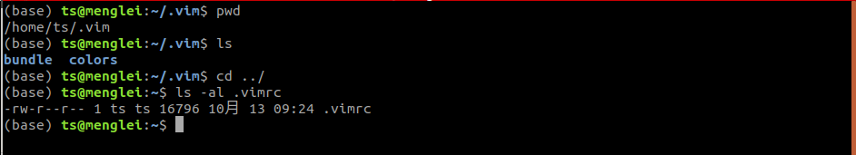

# vim 配置

搬自 https://github.com/jasonnobugs/vim

## step

1. 拷贝 .vimrc 文件到/home/$USER下

   cp .vimrc /home/ts

2. 拷贝 bundle colors 到 /home/$USER/.vim

   ```shell
   cp bundle /home/ts/.vim
   cp colors  /home/ts/.vim
   ```

   